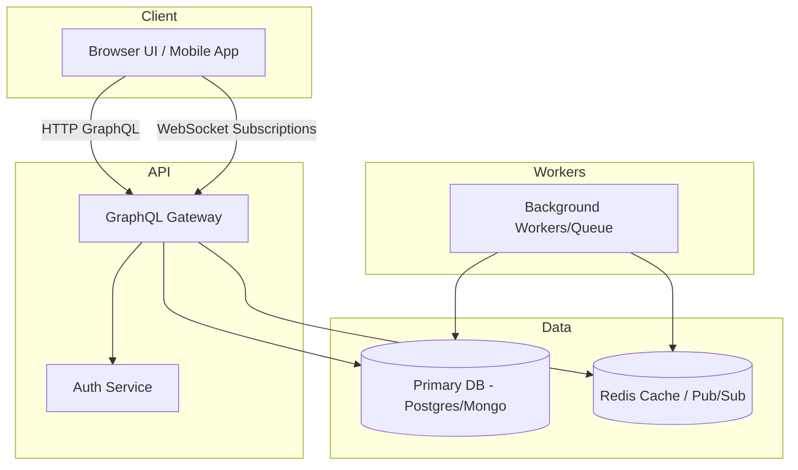

# PluseConnect — Architecture & System Design

This  document explains architecture, data model, schema, deployment, observability, testing, and backup guidance into a single, stakeholder-ready reference.

---

TABLE OF CONTENTS 
- Executive Summary
- Design Principles
- Architecture Overview & Diagram
- Component Responsibilities
- Data Model & Access Patterns
- GraphQL Schema Summary
- Process Flows (Auth, Feed, Post, Chat, Notifications)
- Non-functional Requirements
- Deployment & Operations
- Observability
- Backup & Migration
- Testing & Verification
- Risks & Mitigations
- Required Documentation & Checklist
- Delivery Roadmap

---

## Executive Summary

PluseConnect is designed as a social interaction platform with a strong emphasis on content sharing, real-time messaging, and event-driven user engagement. This architecture is intended to be robust enough for early production use while remaining modular enough to support rapid feature expansion and experimentation.

## Design Principles

- Modularity: isolate frontend presentation, API orchestration, and persistence.
- Resilience: design for partial failure and recovery across real-time and batch flows.
- Observability: make operational behavior visible at the request, subscription, queue, and datastore levels.
- Performance: optimize hot read patterns and avoid repeated or duplicate work in GraphQL resolvers.
- Extensibility: keep data models and API schema open to new social features without broad refactoring.

## Architecture Overview & Diagram

The system is divided into logical layers: Client, API, Data, and Workers.

## Component Responsibilities

- GraphQL Gateway: accepts queries, mutations, and subscriptions; enforces auth and validation; delegates to domain services; publishes subscription events to Redis.
- Auth Service: token issuance, refresh flow, validation and revocation.
- Primary DB: canonical storage for users, posts, comments, messages, stories, and notifications.
- Redis: caching for hot reads, pub/sub for subscription events, and shared session/lock coordination.
- Background Workers: process media, fan-out notifications, rebuild read models, and handle retries.

## Data Model & Access Patterns

### Core Entities (summary)

- User: id, username, email, passwordHash, displayName, bio, timestamps.
- Post: id, authorId, content, mediaRefs, visibility, engagement counters, timestamps.
- Comment: id, postId, authorId, content, timestamps.
- Conversation / Message: conversationId, messageId, senderId, recipientIds, content, delivery/read metadata.
- Notification: id, userId, sourceType, sourceId, payload, read flag, timestamp.

### Read Models & Indexing

- FeedItem: denormalized post snapshot for fast reads.
- NotificationSummary: unread counts and recent notifications per user.

Indexing recommendations: index `createdAt`, `authorId`, `conversationId`, and common filter fields.

Partition large tables by time for archival and query performance (monthly partitions for messages/posts).

## GraphQL Schema Summary

This is a high-level snapshot — the canonical schema should be generated from the server code for exact types.

Types: `User`, `Post`, `Message`, `Notification`.

Sample queries: `feed(cursor, limit)`, `post(id)`, `conversation(id, cursor)`.
Sample mutations: `login`, `createPost`, `sendMessage`.
Sample subscriptions: `messageReceived(conversationId)`, `notificationReceived(userId)`.

Auth: All operations run with a `context` containing `currentUser` when authenticated; use resolver middleware for authorization.

## Process Flows

### Authentication

1. Client calls `login` mutation with credentials.
2. Auth service validates and issues tokens (access + refresh).
3. Client stores tokens and includes access token in GraphQL requests.
4. GraphQL middleware validates token per request and injects `currentUser`.

Notes: Use short-lived access tokens and long-lived refresh tokens with revocation support.

### Feed Request Flow

1. Client requests feed via GraphQL query with cursor.
2. Gateway authenticates, resolves personalization, and fetches from cache/read model or DB.
3. Return paginated result; client uses cursor-based pagination for incremental loads.

Notes: Precompute feed fragments for heavy users and use targeted cache invalidation.

### Post Creation

1. Client submits `createPost` mutation.
2. Backend validates, persists to DB, and emits event to queue.
3. Workers fan-out updates to read models and create notifications.

Notes: Use append-only event logs for replayability and safe fan-out.

### Chat / Messaging

1. Client subscribes to `messageReceived` and posts `sendMessage` via mutation.
2. Backend persists message, updates metadata, publishes event to Redis.
3. Gateway instances forward events to connected WebSocket clients.

Notes: Scale subscriptions with Redis pub/sub; define delivery semantics (best-effort push + persistent history).

### Notifications

1. Backend creates durable notification records on events.
2. Update unread counters and push via subscription if connected.
3. Provide APIs for listing and marking notifications as read.

Notes: Separate persistence from delivery; precompute summaries for UI.

## Non-functional Requirements

- Scalability: stateless GraphQL instances, Redis for coordination, partitioning strategies.
- Performance: DataLoader for batching, Redis caches for hot reads, cursor-based pagination.
- Reliability: durable queues, idempotency, retries, and periodic reconciliation.
- Security: TLS, JWT-based auth, hashed passwords, input validation, rate limiting.

## Deployment & Operations

Topology: CDN for frontend; containerized GraphQL services behind LB; Redis cluster; managed DB with read replicas; autoscaled workers.

Operational configs: TLS termination, health checks, autoscaling rules, secret management, immutable artifacts and rollback.

Promotion: staging → smoke tests → production; immutable image tags for rollback.

## Observability

Metrics: API throughput, p95/p99 latency, subscription counts, publish rates, worker queue lengths, cache hit ratios.

Logs & Tracing: Structured logs with request id and distributed tracing for critical flows (createPost, sendMessage).

Alerts: examples include error rate, latency thresholds, cache hit ratio drops, queue backlogs, DB replica lag.

Runbooks: subscription outage, message delivery delays, DB lock or replica issues.

## Backup & Migration

Backups: full daily backups with 4-hour incremental backups; retain 30 days and archive for 1 year if required.

Restore: quarterly restore tests in staging; document RTO/RPO targets.

Migration: versioned migration tooling (Flyway/TypeORM/Mongock), prefer backward-compatible changes, use feature flags for staged rollouts.

## Testing & Verification

Test types: unit, integration, end-to-end (Playwright/Cypress), performance (k6), and chaos tests.

Automation: CI pipeline with separate jobs for unit, integration, e2e and gating deployments on smoke/integration tests.

Sample matrix: smoke on every deploy; nightly full e2e and load tests.

## Risks & Mitigations

- Subscriptions scaling: use Redis pub/sub, cap connections, heartbeats, segmented channels.
- Feed cost: materialized views or cached slices, cursor-based pagination, narrow queries.
- Data consistency: strong consistency for writes, eventual for read models, periodic reconciliation.
- Security exposure: resolver-level auth checks, validation, auditing.

## Required Documentation & Checklist

| Artifact | Purpose | Status |
|---|---:|---:|
| Architecture diagram | Visualize component relationships and data flow | Completed |
| GraphQL schema reference | Document queries, mutations, and subscriptions | Completed |
| Data model definitions | Capture entity relationships and access patterns | Completed |
| Deployment topology | Define production and staging environment architecture | Completed |
| Observability runbook | List metrics, logs, alerts, and incident flows | Completed |
| Backup/migration plan | Ensure data reliability and upgrade readiness | Completed |
| Testing/verification plan | Define unit, integration, and performance coverage | Completed |

## Delivery Roadmap

This roadmap defines the core completion milestones required to move the design into production-ready implementation.

1. Validate and document the solution model (data diagrams, ADR).
2. Define production architecture, HA patterns, and deployment checklist.
3. Build operational readiness: metrics, runbooks, and incident response.
4. Implement verification: tests, performance targets, and security checks.
5. Stabilize high-risk areas: subscriptions, feed performance, notifications, auth.

---

For implementation details and authoritative source files, see `backend/src/graphql`, `backend/src/lib`, and `frontend/src/lib/apollo.ts`.
