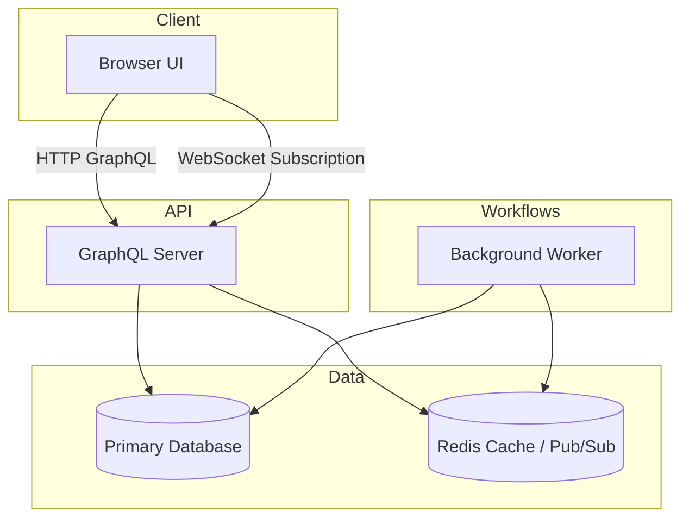

# SocialApp — System Design
## Delivery Roadmap

This roadmap defines the core completion milestones required to move the design into production-ready implementation.

1. Validate and document the solution model.
  - Review `backend/src/models` and produce a data model diagram that includes entity relationships, access patterns, and storage decisions.
  - Document GraphQL schema responsibilities and identify any gaps between product requirements and API support.
  - Capture key architecture decisions in a short ADR-style document.

2. Define the production architecture and deployment plan.
  - Create infrastructure definitions for containers, networking, Redis, and database topology.
  - Document service boundaries, high availability patterns, and failure isolation.
  - Add a deployment checklist that includes staging and production promotion criteria.

3. Build operational readiness documentation.
  - Define monitoring requirements for API latency, WebSocket health, queue backlogs, and cache performance.
  - Create an incident response runbook for subscription failures, message delivery issues, and database outages.
  - Document backup and restore procedures, data retention rules, and recoverability targets.

4. Implement verification and testing documentation.
  - Produce a test plan covering unit tests, GraphQL schema coverage, integration tests, and end-to-end user flows.
  - Define performance test objectives for feed load, messaging throughput, and real-time delivery.
  - Document the security validation checks needed for auth and authorization.

5. Stabilize high-risk architectural areas.
  - Prioritize fixes for the highest-risk areas: subscription scaling, feed performance, notification reliability, and auth enforcement.
  - Track each risk with a mitigation plan and update the documentation as the design evolves.

---

For implementation details, refer to `backend/src/graphql`, `backend/src/lib`, and `frontend/src/lib/apollo.ts`.

### Architectural Roles

- Client: renders state, issues GraphQL requests, and subscribes to live updates.
- GraphQL API: enforces schema contracts, executes business logic, and acts as the entrypoint for read/write operations.
- Persistent Storage: holds canonical data and supports transactional integrity for social actions.
- Cache / Pub/Sub: accelerates reads and coordinates event delivery across service instances.
- Background Worker: performs asynchronous work and keeps request latency low.

## Technology Stack

- Frontend
  - React with TypeScript for UI composition.
  - Vite for build simplicity and fast local iteration.
  - Apollo Client as the GraphQL transport and cache layer.

- Backend
  - Node.js with TypeScript for the GraphQL server.
  - GraphQL schema definition and resolver implementation in `backend/src/graphql`.
  - Context-based authorization and request metadata in `backend/src/graphql/context.ts`.
  - DataLoader support in `backend/src/lib/dataloader.ts` to batch and cache DB accesses.

- Data Infrastructure
  - Primary datastore: optimized for relational integrity and feed queries (Postgres) or flexible document storage (MongoDB).
  - Redis: used for caching, shared session coordination, and pub/sub for WebSocket scaling.
  - Optional queueing infrastructure for background jobs.

- Deployment and Operations
  - Container-based deployment model.
  - CI/CD pipeline for continuous validation and release.
  - Monitoring and logging infrastructure for production visibility.

## Core Components

### Frontend Responsibilities

The frontend is responsible for:
- Composing routes and page state using `src/pages`.
- Rendering feed, story, chat, notification, and profile experiences through `src/components`.
- Executing GraphQL operations in `src/lib/apollo.ts`, including query/mutation routing and WebSocket subscriptions.
- Managing local and shared UI state in `src/store`, with authentication and authorized request handling.

Important considerations:
- UI should remain responsive during network latency by using optimistic updates and cache-first reads.
- Subscription data should merge cleanly into the client cache to avoid stale UI state.
- Error handling must be explicit for auth failures, validation errors, and network retries.

### Backend Responsibilities

The backend performs these roles:
- Guarantees GraphQL schema contracts through typed typedefs and resolvers.
- Authenticates requests and populates `context` with user identity and permissions.
- Coordinates data access while enforcing authorization, validation, and business invariants.
- Publishes events for subscriptions and triggers asynchronous side effects for notifications.
- Uses DataLoader to collapse duplicate database calls and reduce resolver overhead.

Key backend concerns:
- Keep resolver logic shallow and delegate domain rules to reusable service functions.
- Avoid direct DB coupling in GraphQL resolvers by using a service abstraction where possible.
- Preserve correct order for write operations and ensure meaningful error propagation.

### Data Layer Responsibilities

The data layer manages both canonical state and performance-sensitive views.

Primary datastore responsibilities:
- Persist atomic entities such as users, posts, comments, messages, stories, and notifications.
- Support query patterns for feed composition, profile retrieval, and message history.
- Provide transactional semantics for actions that touch multiple entities.

Cache and pub/sub responsibilities:
- Cache hot reads, such as feed fragments and unread counts, to reduce database load.
- Maintain coarse-grained session state for access control and user affinity.
- Propagate event updates across GraphQL server instances for real-time subscription delivery.

Background worker responsibilities:
- Execute long-running business workflows asynchronously.
- Send notification emails or push notifications if integrated later.
- Rebuild or refresh cache entries and perform batch cleanup.

## Data Model and Access Patterns

The data model should balance transactional integrity with efficient read paths.

### Core Entities

- User: identity, profile attributes, account settings, and user preferences.
- Post: author, content, optional attachments, visibility, and engagement counters.
- Comment: parent post, author, content, and creation metadata.
- Story: ephemeral content with start/end lifetime and display metadata.
- Conversation / Message: a thread model for chat where each message belongs to a conversation and carries delivery/read metadata.
- Notification: event-driven user alerts with type, source reference, and read/unread state.

### Access Pattern Recommendations

- Normalize entities where write consistency matters, such as user profile and message persistence.
- Use read models or materialized views for feed and notification lists to avoid expensive joins on user-facing requests.
- Keep hot aggregates (like unread counts and feed snapshots) cached in Redis or a dedicated read table.
- Index fields used for sorting and filtering, such as `createdAt`, `authorId`, and `conversationId`.

## Process Flows

Each user interaction should map to a clear API and data flow.

### Authentication Flow

1. User provides credentials in the UI.
2. Frontend issues `login` mutation to the GraphQL API.
3. Backend validates the credentials, resolves the user record, and verifies account state.
4. Backend issues an access token and, optionally, a refresh token.
5. The frontend stores tokens securely and attaches them to subsequent requests.
6. GraphQL context middleware validates tokens and injects user identity into resolvers.

Architectural notes:
- Separate authentication from authorization so user identity can be reused across services.
- Keep long-lived refresh tokens and short-lived access tokens for safer session handling.
- Support token revocation and session invalidation from the backend.

### Feed Request Flow

1. The home page loads and requests the user's feed.
2. Apollo performs a GraphQL query for feed items, optionally with paging cursors.
3. The API layer authenticates the request, resolves user scope, and identifies the feed context.
4. The backend fetches feed items from the datastore or cache, applying pagination and any personalization filters.
5. If applicable, the backend uses precomputed feed fragments or cached responses to avoid expensive joins.
6. The response is returned and rendered by the frontend.

Architectural notes:
- The feed is the highest volume read path and should be optimized for fast access.
- Prefer cursor-based pagination to keep result sets stable and support incremental loading.
- Use cache invalidation strategies that are targeted to the affected user or feed view.

### Post Creation Flow

1. User submits a new post from the UI.
2. Frontend invokes the `createPost` mutation with the post payload.
3. Backend validates content and authorization.
4. Backend persists the post to the primary datastore.
5. The backend triggers downstream actions:
   - publish a feed update event;
   - create notifications for followers if required;
   - refresh cache entries for affected timeline views.
6. The frontend updates local state optimistically or refetches the post list.

Architectural notes:
- Capture creation events in an append-only log or queue if replayability is required.
- Use a fan-out strategy for notifications and feed updates to avoid expensive writes during user-facing requests.
- Carefully manage consistency between the canonical post record and denormalized read caches.

### Chat and Messaging Flow

1. User opens a conversation and subscribes to `messageReceived` events.
2. Frontend uses a WebSocket link for subscription data and continues to use HTTP for mutations.
3. When a user sends a message, the client calls the `sendMessage` mutation.
4. Backend persists the message and updates conversation metadata.
5. Backend publishes the new message to the relevant subscription channel.
6. Recipient clients receive the event and update their local cache.

Architectural notes:
- Subscriptions should be scoped to user or conversation channels to minimize noise.
- Redis pub/sub or a dedicated event broker is required for scaling subscriptions across instances.
- Design delivery semantics clearly: support best-effort push updates and persistent history retrieval.
- Include read receipts and delivery status only if the product requires them.

### Notification Flow

1. Events like comments, mentions, or message receipts generate notification triggers.
2. Backend creates durable notification records keyed by target user.
3. The system updates unread counters and notification summaries.
4. If the recipient is connected, the backend pushes notification events through subscription channels.
5. The frontend displays notification badges and menus.

Architectural notes:
- Notification state should be durable and queryable even if the user is offline.
- Keep delivery and persistence separate: a notification may be created once and delivered multiple times.
- Precompute unread counts and recent notifications for fast UI rendering.

## Non-functional Requirements

### Scalability

- Treat GraphQL servers as stateless horizontally scalable services.
- Use Redis to share subscription routing state and to coordinate session or cache invalidation.
- Partition load by user, by conversation, or by feature where necessary.
- Use asynchronous pipelines for non-critical write path operations.

### Performance

- Optimize the feed and messaging paths as the most performance-sensitive.
- Use DataLoader for resolver-level batching and caching.
- Cache hot objects in Redis and leverage TTLs to keep caches fresh.
- Keep payloads bounded through pagination and projection of only the necessary fields.

### Reliability

- Assume failure in each layer and build retry/timeout behavior.
- Use durable queues for side effect work and support idempotency.
- Monitor error rates, latency spikes, and queue backlog growth.

### Security

- Authenticate requests centrally and authorize at resolver boundaries.
- Protect all transport with TLS and secure token handling.
- Use industry-standard password hashing and secure storage for tokens.
- Validate all inputs and guard against injection attacks.
- Apply rate limits on sensitive operations and enforce quotas.

## Deployment and Operations

### Deployment Architecture

- Frontend artifacts are built once and served from a CDN or static site host.
- Backend services are deployed as containerized instances behind a load balancer.
- GraphQL HTTP and WebSocket endpoints should be exposed through the same domain to simplify client configuration.
- Datastore and Redis should be deployed in a managed cluster with appropriate high availability.
- Separate staging and production environments with identical architecture patterns.

### Observability

- Capture request-level latency, error rates, and throughput for GraphQL operations.
- Instrument subscription connections, event publish rates, and queue wait times.
- Collect structured logs from API and worker processes.
- Alert on service degradation, high error rates, and resource saturation.

### Data Management

- Define backup, restore, and retention policies for the primary datastore.
- Use schema migration tooling to version and evolve the database incrementally.
- Track cache invalidation and ensure stale data is minimized in user-facing paths.

## Risks and Mitigations

### Subscription and Real-time Traffic

Risk:
- WebSocket connections can become a scalability bottleneck and complicate multi-instance routing.

Mitigation:
- Use Redis pub/sub or a dedicated pub/sub bridge for event propagation.
- Cap connection lifetime and use heartbeats to detect stale clients.
- Consider segmented subscription channels by user or conversation.

### Feed Performance and Cost

Risk:
- Querying social feeds directly over normalized data can become expensive.

Mitigation:
- Use materialized feed views or cached feed slices.
- Implement cursor-based pagination and incremental update semantics.
- Keep feed queries narrow and avoid broad joins in the critical path.

### Data Consistency

Risk:
- Asynchronous workflows may create temporary inconsistency between canonical records and read caches.

Mitigation:
- Use strong consistency for write operations, and eventual consistency for derived read models.
- Reconcile caches periodically and provide mechanisms to refresh or reload critical views.

### Security Exposure

Risk:
- Incorrect auth rules can expose sensitive social content.

Mitigation:
- Enforce authorization checks in GraphQL resolvers and middleware.
- Validate every mutation and query parameter.
- Audit access to sensitive resources and log anomalous requests.

## Required Documentation

To close the gap between architecture and delivery, document the following artifacts explicitly:

- Architecture Documentation
  - System architecture diagram showing client, API, data, and worker layers.
  - Component responsibilities and data flow for feed generation, messaging, and notifications.
  - Architecture decisions and trade-offs for GraphQL, real-time subscriptions, and storage choices.

- API Documentation
  - GraphQL schema reference for queries, mutations, and subscriptions.
  - Authentication and authorization flow, including token handling.
  - Client integration guidelines for Apollo Client and WebSocket subscription setup.

- Data Documentation
  - Domain model definitions for User, Post, Comment, Story, Message, Notification, and Conversation.
  - Indexing strategy, read model design, and cache invalidation boundaries.
  - Data retention, backup, and migration approach.

- Operational Documentation
  - Deployment topology, environment separation, and rollback procedures.
  - Observability metrics, alert definitions, and incident response runbooks.
  - Capacity planning assumptions and scaling thresholds.

### Documentation Checklist

| Artifact | Purpose | Status |
|---|---|---|
| Architecture diagram | Visualize component relationships and data flow | Completed |
| GraphQL schema reference | Document queries, mutations, and subscriptions | Completed |
| Data model definitions | Capture entity relationships and access patterns | Completed |
| Deployment topology | Define production and staging environment architecture | Completed |
| Observability runbook | List metrics, logs, alerts, and incident flows | Completed |
| Backup/migration plan | Ensure data reliability and upgrade readiness | Completed |
| Testing/verification plan | Define unit, integration, and performance coverage | Completed |

## Delivery Roadmap

This roadmap defines the core completion milestones required to move the design into production-ready implementation.

1. Validate and document the solution model.
  - Review `backend/src/models` and produce a data model diagram that includes entity relationships, access patterns, and storage decisions.
  - Document GraphQL schema responsibilities and identify any gaps between product requirements and API support.
  - Capture key architecture decisions in a short ADR-style document.

2. Define the production architecture and deployment plan.
  - Create infrastructure definitions for containers, networking, Redis, and database topology.
  - Document service boundaries, high availability patterns, and failure isolation.
  - Add a deployment checklist that includes staging and production promotion criteria.

3. Build operational readiness documentation.
  - Define monitoring requirements for API latency, WebSocket health, queue backlogs, and cache performance.
  - Create an incident response runbook for subscription failures, message delivery issues, and database outages.
  - Document backup and restore procedures, data retention rules, and recoverability targets.

4. Implement verification and testing documentation.
  - Produce a test plan covering unit tests, GraphQL schema coverage, integration tests, and end-to-end user flows.
  - Define performance test objectives for feed load, messaging throughput, and real-time delivery.
  - Document the security validation checks needed for auth and authorization.

5. Stabilize high-risk architectural areas.
  - Prioritize fixes for the highest-risk areas: subscription scaling, feed performance, notification reliability, and auth enforcement.
  - Track each risk with a mitigation plan and update the documentation as the design evolves.

---

For implementation details, refer to `backend/src/graphql`, `backend/src/lib`, and `frontend/src/lib/apollo.ts`.

- Prioritize strategic architecture initiatives.
  - Stabilize real-time delivery and subscription routing.
  - Improve feed performance through caching and incremental updates.
  - Harden notification durability and offline recovery.

---

For implementation details, refer to `backend/src/graphql`, `backend/src/lib`, and `frontend/src/lib/apollo.ts`.
